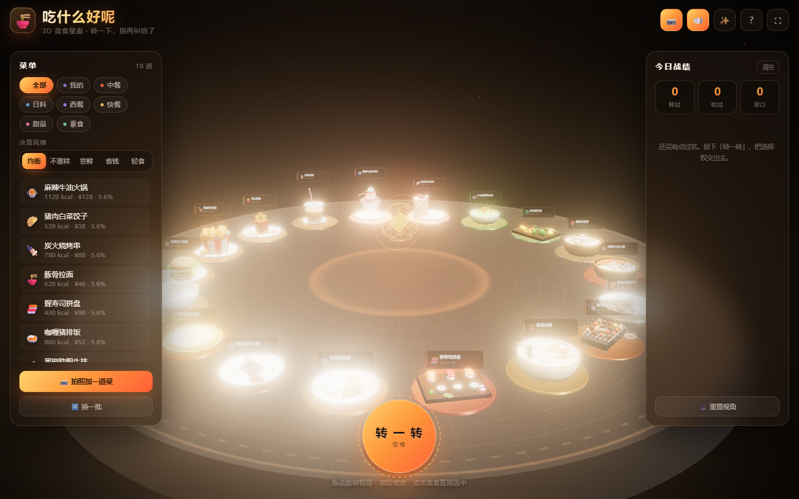

# 吃什么好呢 · 3D 美食星盘

> 一个用 **three.js** 写的选择困难症终结器。
> 18 道菜摆在一张圆桌上，转一下，指针停在哪道就吃哪道。
> **还能自己拍照加菜** —— 拍一张你正在纠结的东西，它立刻变成一张立在盘子里的照片卡，一起参与转动。

**所有 3D 内容都是代码在运行时程序化生成的**：菜品、盘子、餐具、汤底、蒸汽、光效，没有引入任何外部模型 / 图片 / 字体 / 音频素材。



---

## 目录

- [它能干什么](#它能干什么)
- [跑起来](#跑起来)
- [在手机上用](#在手机上用)
- [拍照加菜是怎么做的](#拍照加菜是怎么做的)
- [技术实现](#技术实现)
- [项目结构](#项目结构)
- [测试](#测试)
- [我想要你的需求](#我想要你的需求)
- [许可](#许可)

---

## 它能干什么

### 🎡 转一转就完事

按「转一转」（或 <kbd>空格</kbd>），星盘飞转、稳稳停住、光柱落下、镜头推近，
弹出一张卡片告诉你今天吃什么。转动曲线是「回拉扯手 → 加速 → 匀速 → 五次缓出」，
**停下来的那一刻角速度刚好归零**，不会突兀也不会过冲。

### 📷 拍照加菜（手机上是真·拍照）

点右上角的 📷，就会调起相机（手机上直接开后置摄像头，电脑上是文件选择）。
拍完的照片会：

1. 自动压到最长边 1024、转成 JPEG（一张手机照片通常压到 100KB 以内）；
2. 自动**提取主色调**当作这道菜的主题色 —— 光圈颜色、菜单圆点、发光条都跟着变；
3. 存进 **IndexedDB**，元数据存 localStorage，照片**只留在你自己的设备上，不上传任何服务器**；
4. 在星盘上变成一块**立在盘子里的照片立牌**，底边一条主题色发光条，跟着转盘一起转。

没拍照片也能加，会给你一张带图标的占位卡。

### 🎯 它是真的在帮你决策

| 决策风格 | 干什么 |
| --- | --- |
| 均衡 | 众生平等，纯看手气 |
| 不重样 | 最近出现过的自动降权（8 次窗口内每出现一次 ×0.34） |
| 尝鲜 | 从没吃过的 ×3.2，吃过越多权重越低 |
| 省钱 | 越便宜概率越高 |
| 轻食 | 热量越低概率越高 |

菜单里会**实时显示每道菜被抽中的概率**，你能看见权重是怎么算的。
所有风格都会额外躲开「上一次刚点过」的那道菜（×0.08）。

### 📱 手机优先

不是把桌面版缩小，而是换了一套取景思路：

- 竖屏手机的水平视野只有 20° 出头，**整个星盘根本塞不进去** ——
  所以窄屏时自动加大 fov、拉近相机、收紧环半径，一次看到正前方两三道菜，
  其余的靠转盘转过来（小屏上这反而更好点）。
- 加菜表单在手机上是**从底部升起的整屏抽屉**，主按钮贴在拇指够得着的位置。
- 输入框字号锁 16px，**iOS 聚焦时不会强行放大页面**。
- 适配刘海屏安全区、旋转屏幕后重新取景、名牌在窄屏自动放大。

### 其它

- **换一批**（<kbd>S</kbd>）：重新摆盘。
- **忌口**：`以后别推荐` 之后真的不会再出现，清单在右侧可以随时解除。
- **战绩**：区分「转过」和「吃过」，记录最常点名的菜。
- 快捷键：<kbd>空格</kbd> 转 / <kbd>R</kbd> 重置视角 / <kbd>H</kbd> 帮助 / <kbd>F</kbd> 显示帧率 / <kbd>1-9</kbd> 直接选第 N 道菜。
- **帧率不足时自动降画质**，并在低帧率设备上压缩旋转时长，不会让你干等一分钟。

---

## 跑起来

```bash
pnpm install
pnpm dev        # → http://127.0.0.1:5183/
```

用 npm 也一样：`npm install && npm run dev`。

| 命令 | 作用 |
| --- | --- |
| `pnpm dev` | 开发服务器 |
| `pnpm build` | 生产构建到 `dist/`（`base: './'`，可直接丢到任意静态托管 / GitHub Pages） |
| `pnpm preview` | 预览构建产物（:5184） |
| `pnpm test` | **无浏览器**冒烟测试（461 项） |
| `pnpm check` | **真实浏览器**验收（60+ 项，会自动截图到 `shots/`） |
| `pnpm run preview:ascii shots/01-boot.png` | 把截图降采样成字符画，在终端里核对构图 |

需要 Node 20+ 和一个支持 WebGL2 的浏览器。

---

## 在手机上用

1. 手机和电脑连同一个局域网，用电脑的局域网 IP 打开：
   ```bash
   pnpm dev --host
   # 然后手机访问 http://192.168.x.x:5183/
   ```
2. 想要「像 App 一样」，可以在 Safari / Chrome 里选「添加到主屏幕」。
3. 想直接部署的话，`pnpm build` 之后把 `dist/` 丢到任意静态托管即可，
   GitHub Pages / Vercel / Netlify 都可以。

---

## 拍照加菜是怎么做的

这部分值得单独说，因为它是「用户内容」和「程序化 3D」的接缝。

```
用户拍照
   ↓  <input type="file" accept="image/*" capture="environment">
preparePhoto(file)              src/data/custom.js
   ├─ createImageBitmap 解码
   ├─ 画到 canvas，最长边压到 1024
   ├─ accentFromPixels()  →  主题色（见下）
   └─ canvas.toBlob('image/jpeg', 0.82)
   ↓
addCustomDish()                 元数据 → localStorage
   └─ idbPut(id, blob)          照片 → IndexedDB
   ↓
createPhotoTexture(bitmap)      src/three/models/custom.js
   └─ 走 canvas 而不是直接拿 ImageBitmap 当贴图
      （ImageBitmap 的 flipY 在 WebGL 下不可靠）
   ↓
buildPhotoPlaque({ dish, texture })
   └─ 盘子 + 卡槽 + 微微后仰的照片卡 + 主题色发光条 + 撑脚
```

**主题色提取**（`accentFromPixels`）是一个纯函数，所以能被测试覆盖：

1. 丢掉接近纯黑 / 纯白的像素（没有色彩信息）；
2. 按**饱和度平方**加权求平均 —— 越鲜艳的像素越算数，避免整张图被背景的灰吃掉；
3. 把结果拉到一个固定的高饱和、中等亮度区间。

这样无论用户拍的是昏暗的火锅还是过曝的白盘子，出来的主题色都稳定好看。
全黑或全白照片会退回主题橙色。

**降级策略**：IndexedDB 不可用（隐私模式、老浏览器）时，
加菜依然能成功，只是照片不会保存下来 —— 不会因为存储不可用就整个功能失效。

---

## 技术实现

### 渲染管线

```
WebGLRenderer (ACESFilmic + sRGB)
   └─ EffectComposer
        ├─ RenderPass
        ├─ UnrealBloomPass     ← 炭火、灯带、光柱、名牌边框靠它发光
        └─ OutputPass          ← 色调映射与色彩空间在最后一步统一处理
```

环境光不是 HDR 文件，而是用一组**自发光面板搭出一个「影棚」**再用 `PMREMGenerator` 烘成环境贴图。
光照是半球光 + 暖色主光（唯一投影光源）+ 冷色补光 + 橙色轮廓光 + 桌面中心的暖色点光。

### 18 个程序化菜品模型

`src/three/models/` 下按菜系分成 6 个文件，全部由 `LatheGeometry` / `ExtrudeGeometry` /
`TubeGeometry` / 噪声位移球体拼出来：

| 分类 | 菜品 |
| --- | --- |
| 中餐 | 麻辣牛油火锅（鸳鸯锅 + 干辣椒 + 花椒）、猪肉白菜饺子（带褶皱）、炭火烧烤串 |
| 日料 | 豚骨拉面（七股面条 + 溏心蛋 + 叉烧）、握寿司拼盘、咖喱猪排饭 |
| 西餐 | 黑椒肋眼牛排（三分熟断面 + 烤痕）、玛格丽特披萨、奶油培根意面 |
| 快餐 | 双层芝士汉堡（芝麻按穹顶曲面算）、脆皮炸鸡桶、黄金薯条 |
| 甜品 | 珍珠奶茶（透明杯 + 沉底珍珠）、草莓冰淇淋圣代、草莓奶油蛋糕（扇形切角露出夹层） |
| 素食 | 牛油果藜麦沙拉、烤时蔬拼盘、菌菇豆腐煲 |

模型工厂只返回一个 `THREE.Group`，**位置和尺度由 `normalizeModel()` 统一归一化**
（XZ 居中、底面贴 y=0、最大水平尺寸不超过约定值），所以模型之间不会互相打架。

### 转盘数学

`src/three/wheel-math.js` 是**纯函数、不引入 three**，因此可以被直接测试：

- `spinTarget()` 保证一定向前转，并且**精确**停在第 index 个盘子上（误差 < 1e-9）；
- `createSpinCurve()` 的三个接缝处**角速度严格连续** —— 减速段用五次缓出，
  它的初始导数是 `5Δ/T`，令 `Δ = ωT/5` 就能和匀速段完美接上。

### 相机

揭晓时不是硬切镜头，而是**保持用户当前的方位角**、只缩短距离并抬高，飞过去看向中选的盘子
（飞行期间关掉 OrbitControls，落地恢复），所以无论用户把视角转到哪里都不会穿帮。

---

## 项目结构

```
src/
├── main.js                 入口：状态 / 场景 / 星盘 / 导演 / 特效 / UI 接线
├── state.js                Store：分类、决策风格、忌口、历史、动态菜品表（localStorage）
├── style.css               全部手写 CSS，无 UI 框架、无图标字体
├── data/
│   ├── dishes.js           18 道内置菜的元数据
│   └── custom.js           拍照加菜：照片压缩、主色调提取、IndexedDB 存储
├── ui/
│   ├── hud.js              DOM 界面：菜单、战绩、结果卡、加菜表单、快捷键
│   └── audio.js            WebAudio 现场合成音效
└── three/
    ├── scene.js            渲染器、相机取景（含窄屏策略）、光照、环境贴图、后期
    ├── pods.js             星盘：盘子、名牌、蒸汽、状态机、射线代理
    ├── spin.js             转盘导演：飞转 → 落定 → 光柱 → 铺镜头 → 交还 UI
    ├── wheel-math.js       纯数学：落点、曲线、缓动
    ├── effects.js          浮尘、能量核、光柱、蒸汽、爆发、冲击环
    ├── materials.js        69 项共用「厨房材料」库
    ├── geometry.js         几何工具：旋转体剖面、圆角盒、噪声球、锯齿圆环…
    ├── textures.js         Canvas2D 程序化贴图：桌面、名牌、辉光、占位卡
    ├── canvas.js           画布工具（无 DOM 环境下也能跑）
    └── models/             18 个菜品模型 + 照片立牌 + 可复用零件
```

---

## 测试

### `pnpm test` —— 无浏览器冒烟测试（461 项）

不依赖浏览器，直接 import 模型与数学代码做结构校验：

```
▸ 模型构建          每个模型：顶点无 NaN、包围盒有限、底面贴 y=0、XZ 居中、尺寸受控
▸ 数据表一致性      菜品 ↔ 模型工厂双向一一对应
▸ 材质 key 引用     扫描模型源码里所有 M.xxx，确认材质库里真的存在
                    （这条抓到过 M.cucumber 这种手滑）
▸ 名牌宽高比        名牌贴图是 660×220，缩放必须保持 3:1
                    （这条抓到过 update() 里误用 setScalar 把菜名压扁）
▸ 自定义菜品        主色调提取、立牌几何、动态菜品表、删除后忌口清理
▸ 转盘落点数学      25 种盘子数 × 全部序号 × 5 个起始角度，落点误差 < 1e-9
▸ 转速曲线          终点精确、三个接缝速度连续（用「差随 h 收敛到 0」验证）
▸ 决策权重          概率归一、抽样覆盖全部菜品、各种风格偏向正确、忌口绝不被抽中
```

### `pnpm check` —— 真实浏览器验收（60+ 项）

用本机 Chrome / Edge 无头加载页面，覆盖：WebGL 上下文、场景规模、名牌与光柱、
转盘全流程、结果卡片、分类筛选、**拍照加菜的完整链路**（造图 → 上传 → 压缩 → 提色 →
保存 → 刷新后从 IndexedDB 恢复 → 删除）、窄屏布局与加菜抽屉，并自动截图。

> 该脚本用 `--use-angle=swiftshader` 软渲染，帧率只有 1~4 FPS，所以验收要跑几分钟；
> 真机 GPU 上是另一番景象。

**测试抓到的真 bug**（都被回归测试钉住了）：

1. `roughen()` 除以顶点自身长度，把圆柱端面圆心炸成尖刺；
2. 加载遮罩淡出依赖 `visibility` 过渡，过渡没推进时**透明遮罩会永久吃掉全屏点击**；
3. 结果卡片右上角的 ✕ 被带 `transform` 动画的 emoji 按定位层级盖住，点不到；
4. FPS 用被 clamp 过的 dt 计算，慢机器上永远显示 20 FPS，自动降画质永不触发；
5. `speedAt()` 在回拉段导数符号写反；
6. 名牌在 `update()` 里被 `setScalar` 压成正方形，菜名全变形；
7. 在「我的」分类里删掉最后一道自己加的菜，星盘会变空。

---

## 我想要你的需求

这个项目的方向由用的人决定。**任何想法都欢迎开 issue，一句话也行，不用写得正式。**

👉 **[点这里提需求](https://github.com/hencter/chishenme-3d/issues/new?template=feature_request.md&labels=enhancement)**

👉 **[点这里报 bug](https://github.com/hencter/chishenme-3d/issues/new?template=bug_report.md&labels=bug)**

一些我自己也在想、欢迎你来说两句的方向：

- 多人一起投票选菜（一桌人各自转一次？还是共享一个房间？）
- 按「今天心情 / 天气 / 时间」调整权重
- 吃完之后打分，让权重学习你的口味
- 外卖 / 团购平台的真实菜单导入
- 把星盘分享出去，让朋友看到你今天吃了什么
- 更多菜品模型（欢迎直接 PR 一个 `src/three/models/` 下的新文件）

**提需求的时候说清楚「你想干什么」就够了**，不用管技术上能不能实现 —— 那部分是我的事。

想直接改代码也完全可以，提 PR 之前跑一下 `pnpm test`，它是纯 Node 的，几秒钟就出结果。

---

## 许可

[MIT](LICENSE) © 2026 hencter
